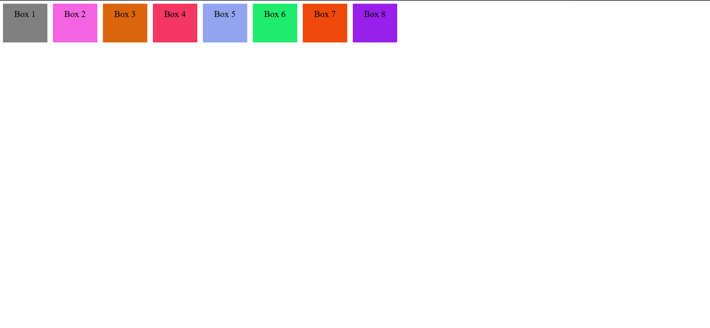

# Week 2 Flexbox Practice

**Name:** INEZA MUSEKURA Esperance

## Project Description

This project is a practice of CSS flexbox properties where elements can be arranged in different positions of a web page.


## Flexbox Properties Used

### 1. `display: flex`

The `display: flex` property makes an element a Flexbox container.

```css
display: flex;
```

It allows us to arrange the items inside the container using Flexbox.

### 2. `flex-direction`

This decides the direction of the items.

```css
flex-direction: row;
```

`row` places items from left to right.

```css
flex-direction: column;
```

`column` places items from top to bottom.

### 3. `justify-content`

This moves items along the main direction (horizontally).

```css
justify-content: center;
```

Other values include:

- `flex-start` - moves items to the start.
- `center` - moves items to the center.
- `flex-end` - moves items to the end.

### 4. `align-items`

This moves items across the main direction (vertically).

```css
align-items: center;
```

Other values include:

- `flex-start` - moves items to the start.
- `center` - moves items to the center.
- `flex-end` - moves items to the end.

## Flexbox Positions in Table

| Position | `justify-content` | `align-items` |
|----------|-------------------|---------------|
| Top-Left | `flex-start` | `flex-start` |
| Top-Center | `center` | `flex-start` |
| Top-Right | `flex-end` | `flex-start` |
| Middle-Left | `flex-start` | `center` |
| Center | `center` | `center` |
| Middle-Right | `flex-end` | `center` |
| Bottom-Left | `flex-start` | `flex-end` |
| Bottom-Center | `center` | `flex-end` |
| Bottom-Right | `flex-end` | `flex-end` |

## Screenshots

### Top-Left



### Center


### Bottom-Right


## Video Demonstration

This video demonstrates my Flexbox practice and the different box positions.

[Watch my Flexbox demonstration video](https://drive.google.com/file/d/1G7s2PUiuKry1zDTuhlOV4jzfbeXhSEZz/view?usp=sharing)

## GitHub Pages

The project is also available as a live website using GitHub Pages.

[View the live website](https://week2-flexbox-practice-arhw.onrender.com/)